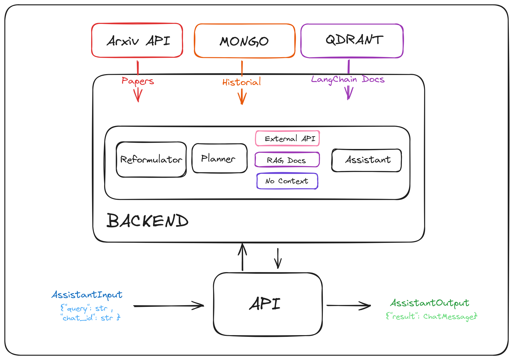

# Prueba Técnica
Candidato: Alfonso Ardoiz
Fecha: 02/08/2024

# Resumen del proyecto
Pequeño asistente para la prueba técnica.

El proyecto que he decidido montar consiste en un asistente con tres funcionalidades: la recuperación de papers de arxiv, la consulta de un par de páginas de docu de LangChain y la resulución de peticiones genéricas.

Como es de esperar, todas las funcionalidades son mejorables y he llegado hasta el punto que me ha dado tiempo.

> El motivo de este proyecto, la recuperación de papers de Arxiv como consulta a API externa, era una cosa que tenía pendiente como proyecto personal y he decidido aprovechar la ocasión... :sunglasses:

# Flow



# Componentes

## 1. Docker
El asistente está montado dentro de un docker que fusiona tres servicios:
    - El backend del asistente
    - Una base de datos vectorial (Qdrant) con tres páginas web de la documentación de LangChain
    - Un Mongo para guardar las interacciones con el usuario y gestionar el historial

Para ello se ha usado un pequeño dockercompose donde se ha vinculado mediante un volumen la carpeta a la que accederán tanto el Qdrant como Mongo y se han asignado los puertos correspondientes
> ¡Importante! Se puede cambiar el puerto local del mongo, en mi caso tenía el 27017 ocupado y he tenido que coger el 27018

## 2. API
El backend está conformado por dos carpetas separadas en funcionalidades, por un lado el código del asistente (src) y por otro todo lo que tiene que ver con el API (apps)

Incluye un archivo boot que sirve como "motor" para poner en marcha el código del asistente, y luego un pequeño API con dos vistas. La propia vista del chat y una vista de health (por defecto).

Para interactuar con el chat hace falta enviar un `AssistantInput` que tiene dos campos obligatorios, la "query" del usuario, y el "chat_id". Este objeto está definido en schemas/models

Finalmente la carpeta apps también incluyen las funcionalidades del mongo. Así el código del asistente solo se encarga de la generación de contenido.

## 3. Código
El núcleo de la prueba técnica. De primeras he organizado todo en chat, y he sacado fuera lo que va a ser utilizado de manera global. Las settings y el logger.

Respecto al código, hay un archivo que sirve de orquestador `core.py` y tres subcarpetas. Este archivo sirve como núcleo y ordena el flujo que se sigue en cada inferencia.

En la carpeta de dominio he definido las clases y objetos propios del sistema, dividiendo en subcarpetas cada funcionalidad concreta. Como mención especial dentro de `domain/generation/langchain_conversor.py` se encuentra un conversor que he creado específicamente para poder intercambiar código de langchain con código puro con la librería de openai.

---

En la carpeta de generación se incluye todas las funcionalidades de los agentes, y las clases particulares que he creado para Azure/Langchain. Al final he buscado aislar el método principal de inferencias, de la propia gestión de los mensajes por parte de los agentes.

Respecto a los agentes he incluido los siguientes:
- **Reformulator**: Se encarga de mejorar la query del usuario usando la conversación anterior. Para ejemplificar su uso, podemos pensar en que si un usuario pregunta: "Mejor restaurante de Madrid", y su siguiente petición es "Y de Valencia?", lo que realmente está preguntando es "Mejor restaurante de Valencia". Este agente es un prototipo que estoy testeando, y para esta prueba técnica me ha parecido interesante incluir.

- **IR-Reformulator**: Agente específico para las búsquedas en Arxiv. Convierte una query como "Papers recientes sobre LLMs" en el tópico central -> "LLMs" mejorando de esta manera el sistema IR.

- **Planner**: Planificador de los siguientes agentes / flujo de la inferencia. Se le ha dado contexto del asistente y se le ha hecho elegir que camino hay que tomar según la query del usuario. (Lo malo de este agente es cómo he implementado la subsecuente llamada de código...)

- **Assistant**: Agente general para la verbalización del contenido. He estructurado el código de tal forma que sea cual sea el camino seleccionado por el planner, el assistant utiliza la query y el contexto para responder al usuario. Si es una pregunta general no hay contexto, si es una llamada al API de Arxiv será unos papers, y si es el propio RAG, será un doc de la docu de LangChain.

A su vez, además de los agentes, he creado una clase principal para gestionar las llamadas al modelo de openai (concretamente el gpt4o).

Esta clase podría ser definida como LLM en una clase abstracta en otro fichero, pero para hacerlo más simple he decidido implementarlo directamente en dos clases: `AzureClient` y `LangChainAzure`.
Ambas clases incluyen un método para generar texto y otro para generar embeddings (lamentablemente no he tenido tiempo de adaptar la de LC para esto.).

La idea detrás de esta separación Agentes / Cliente, es repartir las funciones y gestionar bien las dependencias. Si abstraemos el funcionamiento de los agentes, vemos que lo único que hacen es preparar la lista de mensajes de cierta manera, y ya es el cliente quién hace la llamada a Azure con la propia función de generar texto y una lista de mensajes.

---

Finalmente la carpeta de búsquedas incluye el código de la llamada a una API externa, y el del RAG.

- **Arxiv**: Hace una petición GET a la API pública de este repositorio de artículos científicos. He hardcodeado que utilice siempre los últimos papers respecto a la query que se haga, pero espero que valga para esta prueba técnica.

- **Qdrant**: Conexión con la base de datos vectorial para utilizar documentos como contexto para RAG. Es un poco triste porque solo hay tres docuemntos en la DB.

---

> Tanto para los agentes como para las búsquedas, se devuelven objetos propios (`TextResponse` y `SearchResponse`) que se utilizarán para la construcción del objeto que devuelve el API que hemos comentado arriba y para el almacenamiento de la inferencia en la base de datos.


## 4. Mongo

Utilizado para la gestión del historial del usuario de manera interna, como para la persistencia del uso del API en una DB.

De manera simplificada, se ha definido un objeto (documento) que se subirá a la mongo, y un par de métodos para insertar/actualizar el documento.

El haber definido objetos propios previamente nos habilita poder seleccionar de cada uno lo que queremos guardar: tiempos de ejecución, referencia de documentos (título y score), costes de cada agente, artefactos intermedios...

## 5. Gestión de librerías, Variables de entorno y Comandos bash

La gestión de librerías se ha realizado mediante poetry.

Para la limpieza del código se ha utilizado pre-commit.

Las variables están guardadas en el .env y luego se ha utilizado pydantic_settings para su uso en el código.

Además, se ha incluido un Makefile con los comandos más cómodos del sistema (cosas de docker y del api).


# Ejecución del programa

¡IMPORTANTE! :boom:
>  Hay que incluir credenciales de Azure en el .env

Simplemente al estar en docker con la ejecución del comando:
```bash
make build
```
Se construyen y lanzan los contenedores del proyecto.

# TODO

- [x] Hacer funcional la API
- [x] Añadir funcionalidades en LangChain
- [x] Crear un ReadMe con la docu
- [x] Añadir un esquema de los componentes
